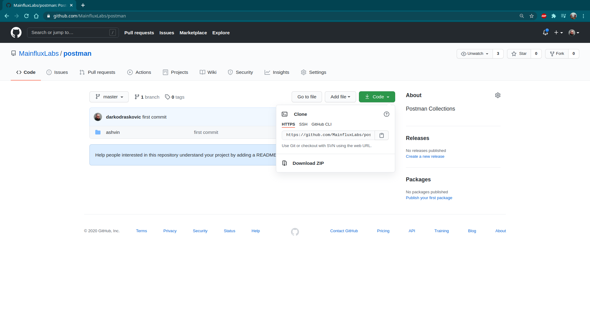
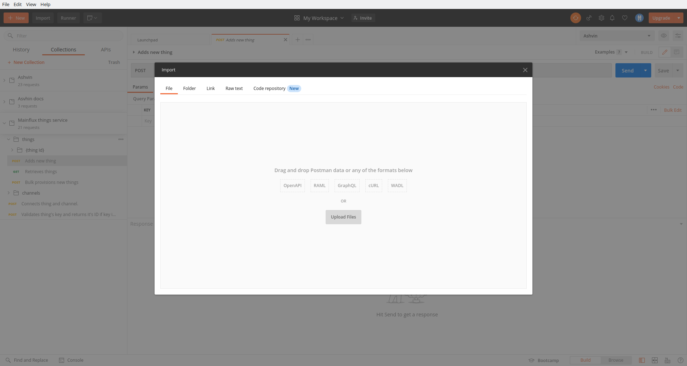
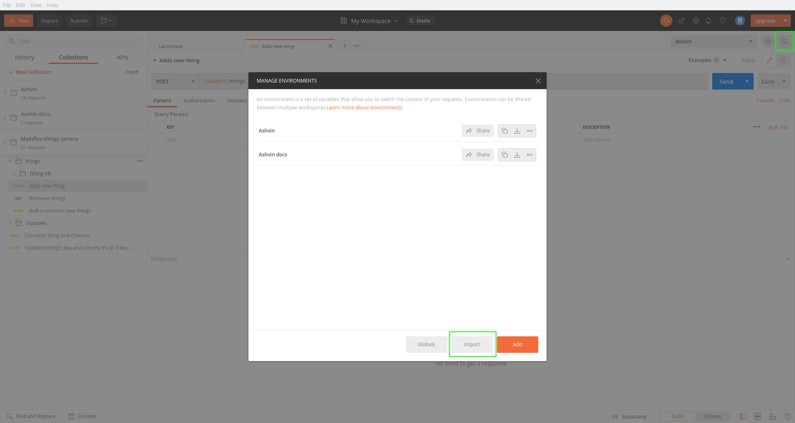

# Postman Collections

## Ashvin Collection

If you don't want to generate the requests yourself, you can go [here](https://github.com/MainfluxLabs/postman/tree/master/ashvin) and download the request collection and the associated environment.

Click on the `Download zip` button, unpack the zip archive. In the `ashvin` folder you will find two files, `Ashvin.postman_environment.json` and `Ashvin.postman_collection.json`. In order to import a collection, click on the `Import` button and then on the `Upload files` button.

Select `Ashvin.postman_collection.json` and follow the procedure.

In order to import an environment, click on the environments button and then on the `Import` button.

Click on the `Choose Files` button, select `Ashvin.postman_environment.json` and follow the procedure.

You use Ashvin collection in conjunction with the Ashvin environment so be sure to select Ashvin environment from the environments dropdown list in order to activate it. Once you select environment, be sure to fill in the environment variables with your desired values for the URL prefix, your user token, thing id, etc.
